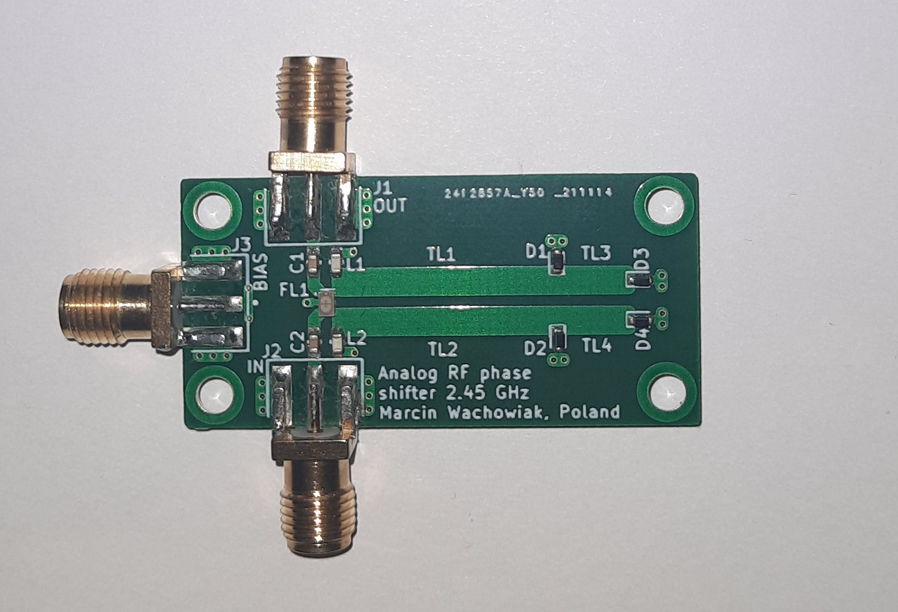
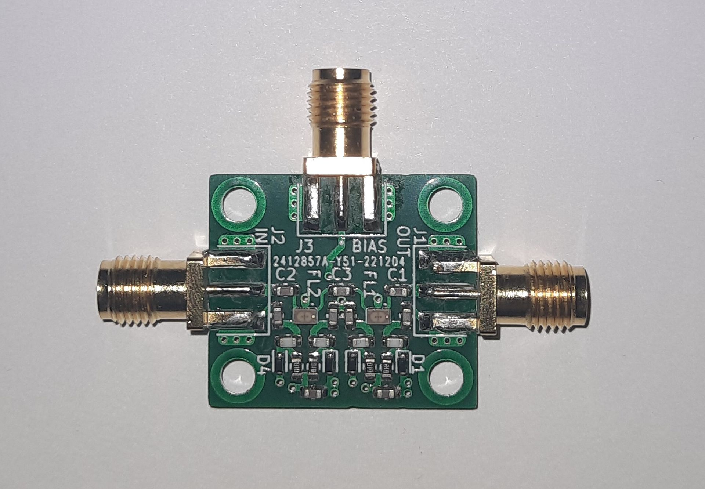
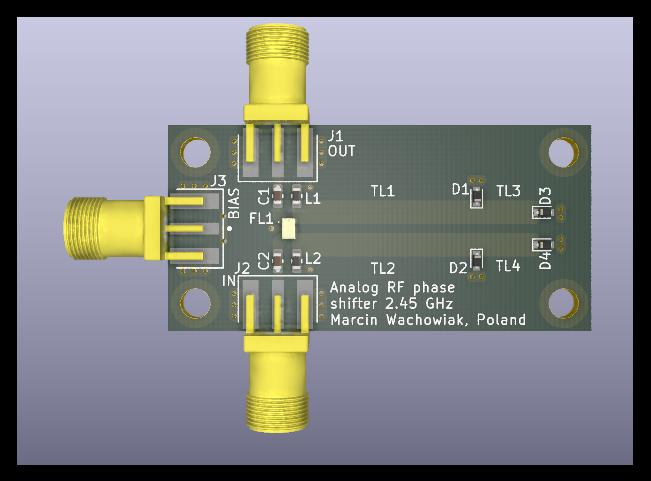
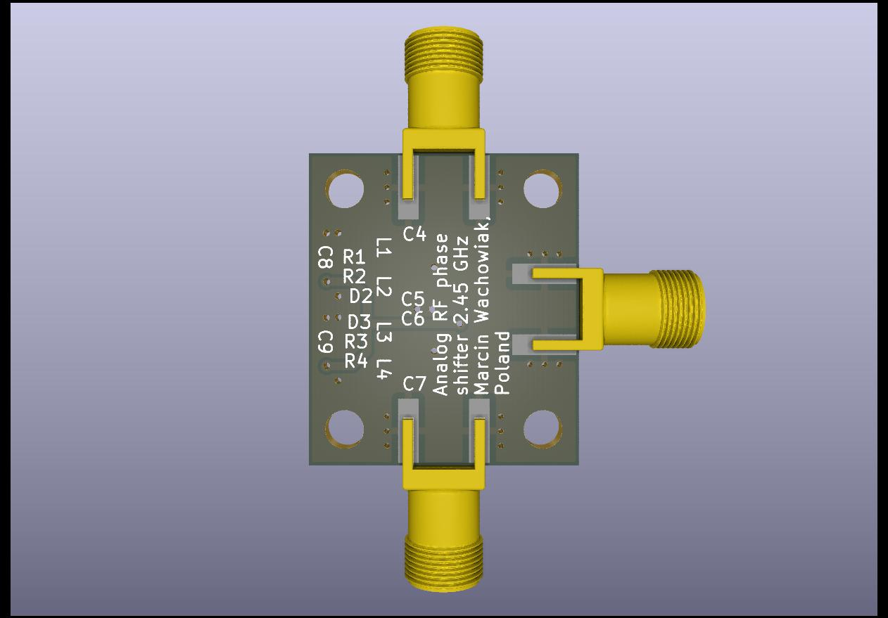
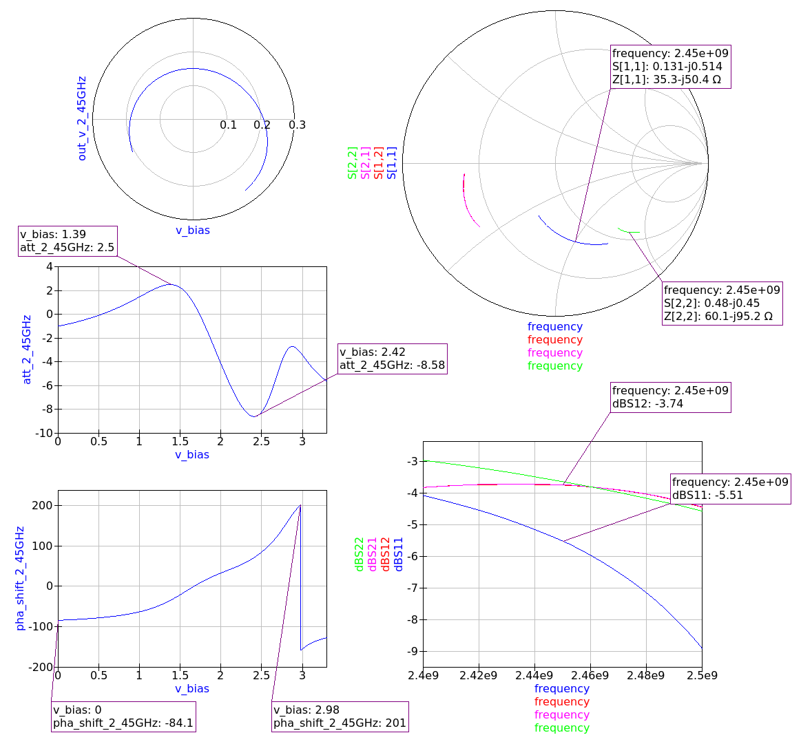
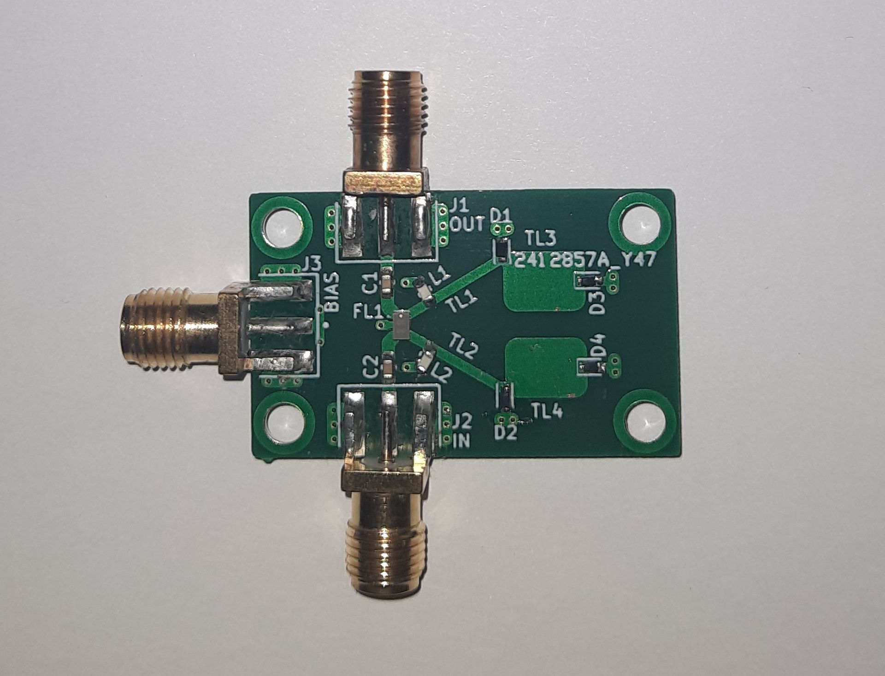
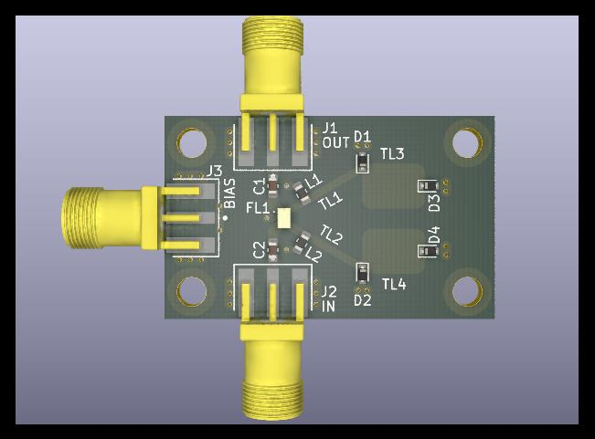
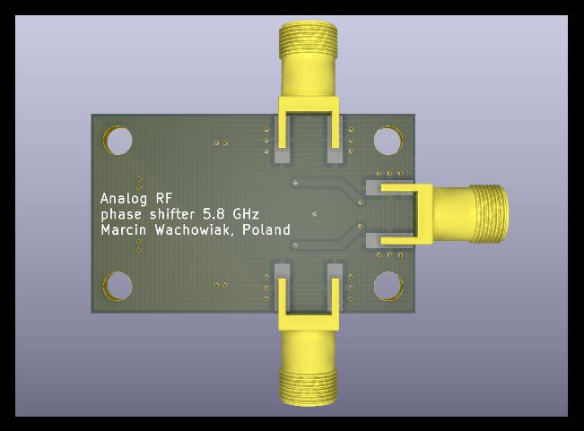

# Analog RF phase shifter module

Analog RF phase shifter modules for 2.45 GHz or 5.8 GHz. Phase shift range up to 360° for input voltage of 0 - 3.3V

**There is a discrepancy between the simulation results and testbed measurements. 
A more detailed analysis of parasitics and fine-tuning of component values is advised.**

 

  - **2.45 GHz distributed components version**

    **Manufactured prototypes:**

    

    **PCB:**
    
    
    

    **Simualtion results:**
    
    

     

  - **2.45 GHz discrete components version**

    **Manufactured prototypes:**

    

    **PCB:**
    
    
    

    **Simualtion results:**
    
    

     

  - **5.8 GHz distributed components version**

    **Manufactured prototypes:**

    

    **PCB:**
    
    
    

    **Simualtion results:**

    

  

