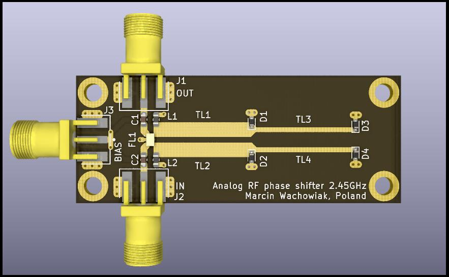
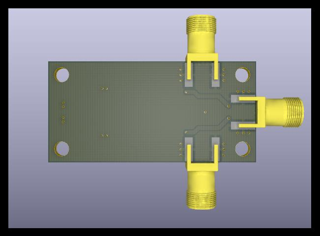
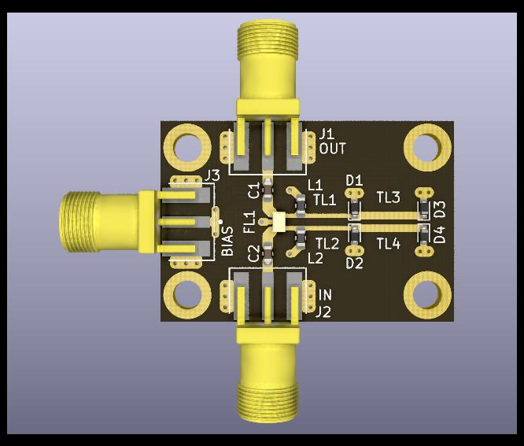
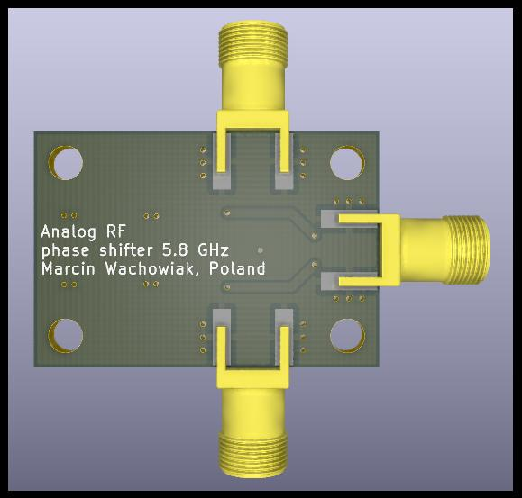

# Analog RF phase shifter module

Analog RF phase shifter module for 2.45 GHz and 5.8 GHz. Phase shift range up to 360° for input voltage of 0 - 3.3V. Can be utilized in phased array for beamforming.

 

  - **Manufactured prototypes**
    

  - **2.45 GHz version**

    
    

  - **5.8 GHz version**
    
    
    

  

